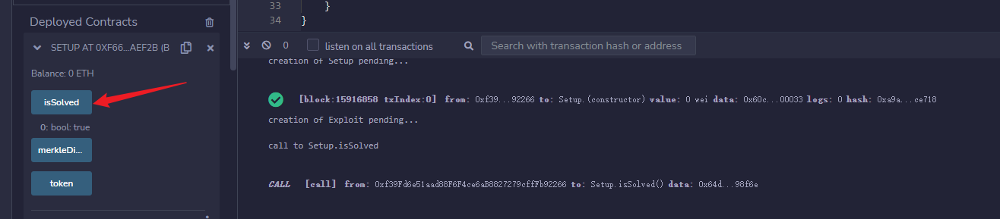

# merkledrop

>  Were you whitelisted?

## 题目分析

```solidity
contract Setup {

    Token public immutable token;
    MerkleDistributor public immutable merkleDistributor;

    constructor() payable {
        token = new Token();
        uint256 airdropAmount = 75000 * 10 ** 18;
        merkleDistributor = new MerkleDistributor(
            address(token), 
            bytes32(0x5176d84267cd453dad23d8f698d704fc7b7ee6283b5131cb3de77e58eb9c3ec3)
        );
        token.transfer(address(merkleDistributor), airdropAmount);
    }

    function isSolved() public view returns (bool) {
        bool condition1 = token.balanceOf(address(merkleDistributor)) == 0;
        bool condition2 = false;
        for (uint256 i = 0; i < 64; ++i) {
            if (!merkleDistributor.isClaimed(i)) {
                condition2 = true;
                break;
            }
        }
        return condition1 && condition2;
    }
}
```

该题目要求我们将**代币全部空投**并且空投地址中**至少有一人没有收到空投**代币。

题目创建了一个新的代币，并准备空投`75000 * 10 ** 18`个代币给64个地址，使用默克尔树进行验证地址是否权接收代币。

默克尔树叶子节点的生成方式是：

```solidity
bytes32 node = keccak256(abi.encodePacked(index, account, amount));
```

`abi.encodePacked`是一种非标准的编码方式。编码后的数据只会有必要的内容信息。例如：`string`和`bytes`和`数组`会失去长度信息；不足`32字节`的类型不会进行大端补齐操作等。

叶子节点的数据类型中：

```solidity
uint256 index
address account
uint96 amount
```

这个`uint96`非常可疑？在`EVM`中，`uint256`占32个字节，`address`占20个字节，`uint96`占12个字节。（address + uint96 正好占32个字节）

在日常开发中，哪怕出现`uint类型`用不到`256位`的情况，也会将变量声明成`uint256`。因为`EVM`是个机器字长`256位`的虚拟机。一次取值会取`256位`出来。所以哪怕用不到`256位`，也不会出现多次取值的情况。

再加上，叶子节点使用`abi.encodePacked`的编码方式。这样就会把`account`和`amount`编码成32个字节的数据。疑点加剧！

但是，虽然可疑，也没有继续解题的思路了。

所以，我就把整棵树打印出来，看看有什么新的思路。

- 首先生成树的所有叶子节点的紧编码数据

  ```
  [
    '0x000000000000000000000000000000000000000000000000000000000000000000e21e550021af51258060a0e18148e36607c9df00000009906894166afcc878',
    '0x0000000000000000000000000000000000000000000000000000000000000001046887213a87dc19e843e6e3e47fc3243a129ad000000041563bf77450fa5076',
    '0x000000000000000000000000000000000000000000000000000000000000000204e9df03e12f21bfb77a97e4306ef4daeb4129c200000036df43795a7caf4540',
    '0x000000000000000000000000000000000000000000000000000000000000000305e1e52d41a616df68810039ad972d6f1280cbae000000195efe9af09f01e4b6',
    '0x00000000000000000000000000000000000000000000000000000000000000040b3041f7d5e847b06cbe83d096f65b3c19869b390000004dfdb4bae7d0d20cb6',
    '0x000000000000000000000000000000000000000000000000000000000000000520ecc9f3dfa1e4cf967f6ccb96087603cd0c0ea50000003b700f748237270c9f',
    '0x000000000000000000000000000000000000000000000000000000000000000621300678bcc7e47c9c7fa58ee4f51ea46ab9114000000024f61ca059bc24bfe0',
    '0x000000000000000000000000000000000000000000000000000000000000000721d11058d97a281ceef9bdd8a5d2f1ca5472e63000000035ddccf9e44848307f',
    '0x0000000000000000000000000000000000000000000000000000000000000008249934e4c5b838f920883a9f3cec255c0ab3f827000000a0d154c64a300ddf85',
    '0x000000000000000000000000000000000000000000000000000000000000000924dd3381afae5d29e8eaf398aa5e9a79e41e8b3600000073294a1a5881b324fe',
    '0x000000000000000000000000000000000000000000000000000000000000000a29a53d36964db6fd54f1121d7d15e9ccd99ad632000000195da98a14415c0697',
    '0x000000000000000000000000000000000000000000000000000000000000000b2a0097816875a110e36cfd07228d6b1bb4c31d760000003b58f426caa31ae7d1',
    '0x000000000000000000000000000000000000000000000000000000000000000c2cc891f5ab151fd54358b2f793f7d80681fab5ae00000037a7e4700ede0a9511',
    '0x000000000000000000000000000000000000000000000000000000000000000d3600c2789dba3d3eb5c36d11d07886c53d2a7ecf0000003d0142d7d7218206f9',
    '0x000000000000000000000000000000000000000000000000000000000000000e3869541f32b1c9b3aff867b1a2448d64b5b8c13b000000cda8b311ab8fa262c8',
    '0x000000000000000000000000000000000000000000000000000000000000000f3accf55fce78e5df0e33a0fb198bf885b0194828000000283eff6bcf599ad067',
    '0x00000000000000000000000000000000000000000000000000000000000000103a0bf58a644ff38f56c79476584394cf04b2ef720000007cb9abf0e3262da923',
    '0x0000000000000000000000000000000000000000000000000000000000000011417d6b3edbe9ad2444241cc9863573dcde8bf8460000004196852d9dc64be33a',
    '0x000000000000000000000000000000000000000000000000000000000000001242dd0823b8e43082b122e92b39f972b939ed597a0000001b97eb44d92febab98',
    '0x00000000000000000000000000000000000000000000000000000000000000134b3570c7a1ff2d20f344f4bd1dd499a1e3d5f4fb0000007f1616a67585a28802',
    '0x00000000000000000000000000000000000000000000000000000000000000144fed95b0d2e1f3bd31e3d7fe90a5bf74ae991c32000000386ffb4b46b6e905c7',
    '0x000000000000000000000000000000000000000000000000000000000000001551e932b7556f95cf70f9d87968184205530b83a500000042ab44de8b807cbc4f',
    '0x000000000000000000000000000000000000000000000000000000000000001658f3fd7dd3efbbf05f1cd40862ee562f5c1a40890000002d1a8654a3b98df3d1',
    '0x00000000000000000000000000000000000000000000000000000000000000175c2de342003b038e81a9e5aa8286dcb7a30dce940000000985fd6041e59eebbb',
    '0x000000000000000000000000000000000000000000000000000000000000001861300d372cfa25e34e5667b45199801ff3f4b3d900000038b5b63d5f211c5a71',
    '0x00000000000000000000000000000000000000000000000000000000000000196a4cebdda50c4480f8772834720dcdcb01cafb5d0000005d1b4cb3431ecb4f1a',
    '0x000000000000000000000000000000000000000000000000000000000000001a6d26e7739c90230349f4f6e8daf8da8188e2c5cd00000033d68b2ef4c9c4e1ee',
    '0x000000000000000000000000000000000000000000000000000000000000001b6b3d0be96d4dd163dcadf6a6bc71ebb8dd42a9b200000055cb74d295a7078628',
    '0x000000000000000000000000000000000000000000000000000000000000001c767911d2c042332f6b2007e86f1dda2b674f61850000002fb5d437c8cd9dfc7f',
    '0x000000000000000000000000000000000000000000000000000000000000001d793652bf3d5dc52b92fc3131c27d9ce82890422d0000002609c108e379ee4aad',
    '0x000000000000000000000000000000000000000000000000000000000000001e7b237d20d18f1872b006d924fa2aa4f60104a296000000304e03adc3e62a2d09',
    '0x000000000000000000000000000000000000000000000000000000000000001f7cd932afcaf03fa09fdfcff35a5a7d4b6b4f479e00000041bc0955cae5406c53',
    '0x00000000000000000000000000000000000000000000000000000000000000207cbb03eaccc122ef9e90ed99e5646fc9b307bcd800000009906894166b087772',
    '0x00000000000000000000000000000000000000000000000000000000000000218250d918318e4b2b456882d26806be4270f4b82b00000038addb61463edc4bc6',
    '0x0000000000000000000000000000000000000000000000000000000000000022860faad971d0e48b96d69c21a32ca288229449c400000013ea41317f589a9e0c',
    '0x000000000000000000000000000000000000000000000000000000000000002388127ef65888a2c4324747dc85ad20b355d3effb00000032cb97226798201629',
    '0x00000000000000000000000000000000000000000000000000000000000000248ce478613de9e8ff5643d3cfe0a82a7c232453e6000000828f60c1e44867745f',
    '0x00000000000000000000000000000000000000000000000000000000000000258a85e6d0d2d6b8cbcb27e724f14a97aeb7cc1f5e0000005dacf28c4e17721edb',
    '0x00000000000000000000000000000000000000000000000000000000000000268ff0687af6f88c659d80d2e3d97b0860dbab462e000000391da2eb282a38e702',
    '0x0000000000000000000000000000000000000000000000000000000000000027959db5c6843304f9f6290f6c7199dd9364ec419d00000033310207c285e55392',
    '0x000000000000000000000000000000000000000000000000000000000000002897d10d05275e263f46e9ea21c9ae62507ebb65e30000001969ca1f270d7cd9d1',
    '0x00000000000000000000000000000000000000000000000000000000000000299b34e16b3d298790d61c4f460b616c91740a4a1a0000003678ab48c78fe81be3',
    '0x000000000000000000000000000000000000000000000000000000000000002aa8cab79beda626e2c3c2530ac3e11fc259f237d60000002db4445d44fddb00d2',
    '0x000000000000000000000000000000000000000000000000000000000000002ba8f416e298066cb578e4377befbdb9c08c6252a800000029e0cb8068d84a987b',
    '0x000000000000000000000000000000000000000000000000000000000000002cb58ad39c58bdf1f4e62466409c44265a896237220000007347e43564a789c880',
    '0x000000000000000000000000000000000000000000000000000000000000002dc379f96dcdf68a5fa3722456fb4614647d1c6bbd0000008202b24cb5d34efa49',
    '0x000000000000000000000000000000000000000000000000000000000000002ec7fa2a8d3b433c9bfcdd93941195e2c5495eae51000000566498ec48a13dd013',
    '0x000000000000000000000000000000000000000000000000000000000000002fc7af0df0b605e4072d85becf5fb06acf40f88db90000002c15bae170d80220aa',
    '0x0000000000000000000000000000000000000000000000000000000000000030cd19f5e3e4eb7507bb3557173c5ae5021407aa250000005f0652b88c2c085aea',
    '0x0000000000000000000000000000000000000000000000000000000000000031cdbf68c24f9dba3735fc79623baadbb0ca15209300000025b42c67c4ec6c225d',
    '0x0000000000000000000000000000000000000000000000000000000000000032e3fb01b0a4e48ce757bfd801002cac627f6064c00000002c756cdfe2f4d763bc',
    '0x0000000000000000000000000000000000000000000000000000000000000033e59820351b7f93ba9dffa3483741b4266280fca40000002c69e7f2c5c1fb4d09',
    '0x0000000000000000000000000000000000000000000000000000000000000034ed43214bb831bb1543566a52b230919d7c74ae7c000000153309c1e553fcfa4a',
    '0x0000000000000000000000000000000000000000000000000000000000000035f5bfa5e1bdaf33df1d5b0e2674a241665c921444000000322180f225fed4b65d',
    '0x0000000000000000000000000000000000000000000000000000000000000036a09674de22a3dd515164fcb777dc223791fb91de000000ac7b6f0812eb26f548',
    '0x0000000000000000000000000000000000000000000000000000000000000037b71d03a0cd1c285c9c32b9992d7b94e37f5e5b5d0000002c5e74f5070dac75d9',
    '0x0000000000000000000000000000000000000000000000000000000000000038b9e1bad69aebc28e8ba5a20701a35185ff23a4fa000000217f2bf08b80310c45',
    '0x0000000000000000000000000000000000000000000000000000000000000039be7df9554c5746fa31bb2cd7b9ca9b89ac733d7c00000014d55d92753f57b739',
    '0x000000000000000000000000000000000000000000000000000000000000003acee18609823ac7c71951fe05206c9924722372a60000003dfa72c4c7dd942165',
    '0x000000000000000000000000000000000000000000000000000000000000003bcf67d2c5d6387093e7de9f0e28d91473e0088e6e00000024b00cf419002103ad',
    '0x000000000000000000000000000000000000000000000000000000000000003ce145dbbefdd4eef0ed39195f2ec75fbb8e55609f00000055123165db2ae9a1a2',
    '0x000000000000000000000000000000000000000000000000000000000000003de333ed021e58ef3a3219d43d304fc331e5e287bb0000002f36bb4329b1d502e3',
    '0x000000000000000000000000000000000000000000000000000000000000003ee629559bf328bda47c528849a31e841a0afff1c7000000248a1b23ff3e32491b',
    '0x000000000000000000000000000000000000000000000000000000000000003ff7a69c5e5257deb4e9f190014fd458711ee4c8aa00000068ccf73cd2b434f5bc'
  ]
  ```

- 再生成整棵树

  ```
  └─ 5176d84267cd453dad23d8f698d704fc7b7ee6283b5131cb3de77e58eb9c3ec3
     ├─ 5271d2d8f9a3cc8d6fd02bfb11720e1c518a3bb08e7110d6bf7558764a8da1c5
     │  ├─ 5ccf0ef336c96ea89a6a1b0fa449644f646e67fdf1099608f560fcf8b55118e8
     │  │  ├─ 21daac29f18f235ede61e08c609f5762e5d12f87d9f014a3254039eb7b71d931
     │  │  │  ├─ 292ea2e708cd883538e918fa5e092fe233fc7ef4be50902e9c63610af22ba9b8
     │  │  │  │  ├─ f467876e338a148fd70b2581b6b3a7469047be31dca35c345a510ef85dba31dc
     │  │  │  │  │  ├─ 00827f08f3d161ff8988e9489ef341a194b5d3a36307e79881af5b8cc03ae154
     │  │  │  │  │  └─ 019c868fa8ed0a5d4d0c902c5bd7b18a53b75b0575e8b8bea70041af9310949f
     │  │  │  │  └─ 68cb43b42c0f1a39502ac222e901a42950ac602e2335eca67a15e3f6a661a7d7
     │  │  │  │     ├─ 0354af4f2c661dc1e918482f626b66f110408fb709894c9c488a001eb0742399
     │  │  │  │     └─ 0701f8f739a2fec08a0e04cc1c3e66fa558dba855236882c5a624d0cea9a4e0b
     │  │  │  └─ d7fc0d5cfae7aea3e6f1c1a6d427c9da67942e8091b8bf719a39cb31442588cf
     │  │  │     ├─ b1408b0fc0b96c6469dd721ebd1c04ec436da2e819765a758fe2f17c9fbf6021
     │  │  │     │  ├─ 095fc5ae9321eabfede2c4fac05af6ae866f315c08b4f60a3d1b5c166de660ed
     │  │  │     │  └─ 098a4ebeaea5dcab6543f613d606a459b71211773fdd3f71a91be667c78cb445
     │  │  │     └─ 1577bdc1958b6677f9e850bbb2b938daa51979ce9af4b0dbcc7f763c3aee1ee3
     │  │  │        ├─ 0f7a6dbdb4f6108c52ea0b0083cba2bc48eb7c0732b2909ba4e06f5c43d95d52
     │  │  │        └─ 115e62dc3725c12935896f44553d0835473aa466efc65b46dc70749bb69655bc
     │  │  └─ 51f609195fe7b01dbe09b4f0c130c652183a94ce57e75ba6ead0fc94d2c4f557
     │  │     ├─ 955c47a5eea3ebf139056c0603d096a40a686b2304506f7509859fe9cc19bd79
     │  │     │  ├─ 4db4c30a97febfe168893f90f7ed6b5d2fd442c87de6db7367ca1f4f254d7560
     │  │     │  │  ├─ 15320e37bd46719b860b97998a11ffb42ff26db76ead7e0c43c22e17806502df
     │  │     │  │  └─ 164465e87b253a734a56bc34e3f4b5f24c5f3ee5cade2a6ca2f8f48535309c95
     │  │     │  └─ 6353fdd25845769b10a6f4e18d04c0a1226d47381aa51bfcb971395733433879
     │  │     │     ├─ 25342959be7576258fb48037698afbc01f7e1d0c391d5039ca70adec577b5a62
     │  │     │     └─ 25e8db86fed4ac88814814f013f23c2356f1e0960ecd26fddd1614de5fa066af
     │  │     └─ 0cd186d2b1377ee96a87ef7a295dec75cc05b54a08fcaca61868911d6ac9bc27
     │  │        ├─ c8a963490279786bf4d9522dad319dd536d7de4764d2fc6564356ff73b49cf16
     │  │        │  ├─ 28b36a3afabfcfd4a6bc37d9275ebc12768dead832b45fe0f798666b3504b761
     │  │        │  └─ 2bb44cee53daf66acb6f397831fc2d678c84b5b09ca7b1fff7afda9bb75ef05e
     │  │        └─ b78206103b20c68f5d201d54f68a9ae27530ce21120501797e6cf8c69f6f2be2
     │  │           ├─ 2f8edd415bf009db0356d04585845763b314d74f9800b601e3d0923eab629a6f
     │  │           └─ 30976e6e39aeda0af50595309cfe319061ee99610d640a3ff2d490653963d22a
     │  └─ 4fcfc1702cc3495bc600779c15a4aec4dc5f6432cbf82d5209c0f07095ffe33c
     │     ├─ 36023974ab0ea95508c311d9ccbf32b662b1ffdb2823817d746f8222ec2dd07c
     │     │  ├─ e17532a1de454f0b97005a3608233cbbdf6680bdefb2eab2dade48d76df0407f
     │     │  │  ├─ 26171694d9e478c26b02ca6850ea3b0d94dba9ead9fc33ed3f0cb59482117454
     │     │  │  │  ├─ 385fe12b0ed97da4970945f46d476ade4f8ec725b58b3440304714681d39cfe8
     │     │  │  │  └─ 42545b56127a9fe8daea5c3cf4036a47cf91f4596b49a70be6e5f807c592a561
     │     │  │  └─ 25e8e051b1e50b71a99e6247bef8c6566c3ec41d3ba014d5963fc31b48169965
     │     │  │     ├─ 4cb280a759741642be3f25ac989578797e1d1295d348755bc71d12890f4e1a06
     │     │  │     └─ 4e5133c9221f862a0116601af29c036030d7a2d6656057ce9a3790751d9380dd
     │     │  └─ 54dfc2bcb68496ea7b8f2e6abbbd3dc442151628379a64aa231ce6fb6aae02b6
     │     │     ├─ 8d95f5b0ee482a4d1f61599c5b35b324a89036b657998b1def0dde35a92123aa
     │     │     │  ├─ 4e7ffaaa80516282b025bb78de5e2ff37bf537c79efbef7d3a76212520edfa1e
     │     │     │  └─ 53af2e862fa1f6e8b669f83b25bfd6d2c3fb52df0ca2d76c03374bffca658b2d
     │     │     └─ 570a5dc89eddc4cdb73631b6f43d3e20a10b272a69b0b9087d778502b4ae034b
     │     │        ├─ 565be7f9f28d9025dba7935e9251d55c9cb6bc8198366d4b99aa072229e015f9
     │     │        └─ 59b5a9cd883510d6863a0715c88a98b079c036a4fb5039a0105ed4b21f3658c5
     │     └─ e3affea7b3ec31efa680e4f2728e46392eea685ce2ca5803848a3637de650e13
     │        ├─ 4651c9cafba7a07e593d2fddecb28bfd6af2c0731126931e60a621684363524a
     │        │  ├─ 62663a6d05597df610cb657a9d6691fd7c5352e6ed2f76f0274c3bc96ec14aed
     │        │  │  ├─ 5a53412f6ed9a29d5c57527fa3d9c32d774387a3994db9f61849cdcb189a2a4c
     │        │  │  └─ 635d83d54c68be93dbb2d55213899ce15315a8052c5fa76b01d2cafc63b1ec16
     │        │  └─ 9fb9f6ee8f0b83a0f1eb41e57eb1b4a53d0dfa86bab2bb38093113670cf2d94c
     │        │     ├─ 65b5391533e6646ac62af8e8d4b2ecb10ccc163fd91ad2309e25299ef0527e6d
     │        │     └─ 6bb0194ee897ebcf7a41ccebee579ab0fe0e191d9e5e9b5815ea2bf8de4c8495
     │        └─ 9c655dc701fa000048be0b99912551f71b77031ce47437fa220120e8b56a877c
     │           ├─ 644ff4aa4c4a5713d7d2189eaf1d60cc99a4924db146f3714d998510f35ed34c
     │           │  ├─ 72000c14174c21b921370d96ba77e711b2e28242f94c8468cf83c30e675da3fb
     │           │  └─ 7216025ef8f0d72ddac0c434ac52525b6946623534ec3cbe5ea1317c27ad7a9a
     │           └─ 43047705e643f244c1fa91232f837793bd978d50a148cccdcb5883cd20d21f07
     │              ├─ 72c98c344d8b36b7c169dc9d3ea7e43f6927b605aa869fe5fd76dc606edd283b
     │              └─ 763326fbee252000fc15343ef2cc074ab3414dbc8e35312781451927dce56f80
     └─ 3d159ff1e06840b9a541438da880d6637874661722c48e37343c9e6329245c2e
        ├─ 0e3089bffdef8d325761bd4711d7c59b18553f14d84116aecb9098bba3c0a20c
        │  ├─ e2eae0dabf8d82b313729f55298625b7ac9ba0f12e408529bae4a2ce405e7d5f
        │  │  ├─ 449eac22434639a214604e71bc3c53ee18a2803f1cca16000e5d26fe3ee6ac11
        │  │  │  ├─ 3c7a509d9a786d3476cf62d5076e246cdc15572aadfbfc49993290bea04dc33e
        │  │  │  │  ├─ 7b43e82a88f0da5db71bc1c82f1515b9b17ff69e88ec3f101a50cfd98d7f60ce
        │  │  │  │  └─ 7c6732545262910be97f294b94dfe4a16612869a1e167184895d72b316f10717
        │  │  │  └─ 5eeac0a5817d0a92ac8111f5baea4d21a3d9a935bb9a8ab87c326d52fe9dce44
        │  │  │     ├─ 7c8901ce6a2988d1b59e96b346a1da117f0360266f2357a2b35e42de68d67b62
        │  │  │     └─ 7ed7078322373dc76f5fd327fe18d63e1fd9811c162527711a2523a79595d383
        │  │  └─ 6396734133b37a66dcaf6e892db605531ae16ff8945cbccc5590b3624bbda293
        │  │     ├─ 72828ce11efc964cf1f828f243091a1783032ec9dbe26d53d1ef15beb050508c
        │  │     │  ├─ 7ff95132a090b7338eb1e2937425f14f7e112cca82de611f0eab14b5310848ec
        │  │     │  └─ 8652a5d44578e32b80888eba7b90d776d65f946d28c2a92a174c28061eb19470
        │  │     └─ a9fd6f5ade2e4b246e93337936684b7a5cc7285dca4caf3b26203f258211bb75
        │  │        ├─ 9907e0ad71155513cb3a0fa6fb714b1bbdd5b85005a6cae4f32d68d843bec8b8
        │  │        └─ 99ac0dc09380e26dabe05f039a3d36fbc562b612f40ada5d1707be5246663800
        │  └─ f2511a8dc138320a73ce3b126adfa94a3e290691a9071d85189d01ef860bd734
        │     ├─ 3f267b524a6acda73b1d3e54777f40b188c66a14a090cd142a7ec48b13422298
        │     │  ├─ 0c15f6d9f61156109f0005f9b7f675b23e7aec4694ab76571f78c1e967dc99ef
        │     │  │  ├─ 9c3fd7a427a178d8c3b3884bb706cc850287c4288d2e065be739b0e908e93fef
        │     │  │  └─ a0043ed2863bf56a6190c105922498904db3844dad729b3f5d9c6944a5dd987c
        │     │  └─ d29a8264fe1886a31674e30d34a918354022351498a0f42f68f12e0ca2fb3a09
        │     │     ├─ a18d9178bab44c66a0ec909913a9168fb57675f96be4dc78e5bd5c3d62bdf585
        │     │     └─ a2f005afe53c681aec101c5107b1bc6619e1ebaea3d55fc38dabac341c958619
        │     └─ 41e12276ae416e87527eef564a668374da0157d93387edd75796ffeab88bf849
        │        ├─ 86f8b4db67c570567b6d8c72a4127cce15ed261863f0fc28c63bfa9e92a8c4fd
        │        │  ├─ a37b8b0377c63d3582581c28a09c10284a03a6c4185dfa5c29e20dbce1a1427a
        │        │  └─ a9e8f0fbf0d2911d746500a7786606d3fc80abb68a05f77fb730ded04a951c2d
        │        └─ 0ae01ec0f7a50774e0c1ad35f0f5efcc14c376f675704a6212b483bfbf742a69
        │           ├─ ad664d58ccd7f0f2c817ae6a1620d88e4602131e17207efdd89f6cf98b903628
        │           └─ b142a5c6b86dd9fdd364b8aef591f47c181dcfbd41cde017eee96c7b8a686e2e
        └─ 01cf774c22de70195c31bde82dc3ec94807e4e4e01a42aca6d5adccafe09510e
           ├─ abde46c0e277501c050793f072f0759904f6b2b8e94023efb7fc9112f366374a
           │  ├─ c999b0a9763c737361256ccc81801b6f759e725e115e4a10aa07e63d27033fde
           │  │  ├─ 83f60a763e672b25703da0229e530c207933554cc4c26dfe30d69b11a2f5e511
           │  │  │  ├─ badd8fe5b50451d4c1157443afb33e60369d0949d65fc61d06fca35576f68caa
           │  │  │  └─ beba51d0cb0bc6339edf1832ce33515c92b2bfdbf243e531188470ca084b3b2d
           │  │  └─ b74970b484c464c0e6872c78a4fec81a5166f500c6e128052ca5db7a7e22d858
           │  │     ├─ c54d1feb79a340c603744a595a63cc1e121980ff876c288eaeb67a7c58cb1d12
           │  │     └─ c75df667b1e0673d6434808d3e4466c39f61a00b113663a58cfdbfc7ccef29e3
           │  └─ f5f6b74e51a15573007b59fb217c22c55fd9748a1e70578c6ddaf550b7298882
           │     ├─ 8920c10a5317ecff2d0de2150d5d18f01cb53a377f4c29a9656785a22a680d1d
           │     │  ├─ d0387293a05c1b496ebb8671e1490cf3032c5d22617f616e99189f6dfc698507
           │     │  └─ d2b8ed2291e92e504017d646568210a107890c34d22aed283cb1a77d1ff66b9d
           │     └─ 225de26d438b50d8afea1120376d92b188d770338d4629a6cfbd09c7af39d34c
           │        ├─ d43194becc149ad7bf6db88a0ae8a6622e369b3367ba2cc97ba1ea28c407c442
           │        └─ d48451c19959e2d9bd4e620fbe88aa5f6f7ea72a00000f40f0c122ae08d2207b
           └─ 842f0da95edb7b8dca299f71c33d4e4ecbb37c2301220f6e17eef76c5f386813
              ├─ 2fa599012c0491428e6451d1cc1511f133f82c66ee98b9eefc1b4c263db48518
              │  ├─ d779d1890bba630ee282997e511c09575fae6af79d88ae89a7a850a3eb2876b3
              │  │  ├─ d6948c2c22e5c79cf7aa1dcce8e6927388d7c650445159b9e272f84c95a032e6
              │  │  └─ dae406929d3fb1a4f6b11c05a71ca6a8c86ad99c770abcbf5eb98a5fa0447734
              │  └─ 19e39d26bfd282e8e58964c4d9e4bc060308166347034e432d8a9fbefb2c6e68
              │     ├─ db13455978d0488dcb105492f8ea54142f9d500a89bf049bcf00b7fe4c5bdcca
              │     └─ e10102068cab128ad732ed1a8f53922f78f0acdca6aa82a072e02a77d343be00
              └─ 46b46a28fab615ab202ace89e215576e28ed0ee55f5f6b5e36d7ce9b0d1feda2
                 ├─ b237516aa3fae34a6ca09a662b8457ffb22dd2dfc5aa144e0d6c0f2445821b86
                 │  ├─ e13771d2a0c4dea1be80f66f0a2c74f429151e8146d642c4306be93190bc89c5
                 │  └─ eab835a5226ecd7bb468ab6f2a12db05290e3bc52a5009f85df966d12909d159
                 └─ d5423e8e964fcfbe8025bf3f96273ba0c0039f284d40c720a8466bd39e5d3eb9
                    ├─ f552c4b0909600d226d5f42161c58f7a5722027298f8c204247323336262be88
                    └─ fb6d302655b6f6a8f6f1aca20a3edb8c6c8c4640daab78796f3e1c0cd0ec8606
  ```

  

## 解题思路

在所有叶子节点的哈希值中，如果按照前20个字节，后12个字节进行分割，有一个节点尤为特殊

```
0xd48451c19959e2d9bd4e620fbe88aa5f6f7ea72a	00000f40f0c122ae08d2207b
```

这个叶子节点哈希值是第19号叶子节点的哈希值，是第37号地址的首个证明节点哈希值。

```
0x0000000000000000000000000000000000000000000000000000000000000013
4b3570c7a1ff2d20f344f4bd1dd499a1e3d5f4fb
0000007f1616a67585a28802
```

而第37号叶子的哈希为

```
0xd43194becc149ad7bf6db88a0ae8a6622e369b3367ba2cc97ba1ea28c407c442
```

这个节点正好后12个字节前5位都是0；`0x00000f40f0c122ae08d2207b` = `72033437049132565012603` = `72033.437049132565012603 * 10 ** 18`

而且`72033.437049132565012603 * 10 ** 18`小于总空投量` 75000 * 10 ** 18`。

`75000000000000000000000`- `72033437049132565012603`=`2966562950867434987397`=`0xa0d154c64a300ddf85`

而`0xa0d154c64a300ddf85`正好是第8号地址的空投数量。

所以我们可以使用：第37号叶子的哈希值当做`index`的数据，第19号叶子的哈希值当作`account`和`amount`紧密编码后的数据。也就是将37号和19号的父节点的哈希值`0x225de26d438b50d8afea1120376d92b188d770338d4629a6cfbd09c7af39d34c`当做叶子节点的哈希值，进行空投的领取。

另外再领取第8号叶子的空投，这样就可以将`75000 * 10 ** 18`个代币全部领取。



## 参考资料

https://github.com/paradigmxyz/paradigm-ctf-2022

[PARADIGM CTF 2022题目分析(4)- MerkleDrop分析](https://mp.weixin.qq.com/s?__biz=Mzg4MDcxNTc2NA==&mid=2247483911&idx=1&sn=126c950076f3cb0e6b27f396fcd668b9&chksm=cf71b09cf806398a0e05bda4ef389a927e87eab53e50604825adf7cdf82e8109f4c226e56c75&scene=178&cur_album_id=2556040001080557569#rd)